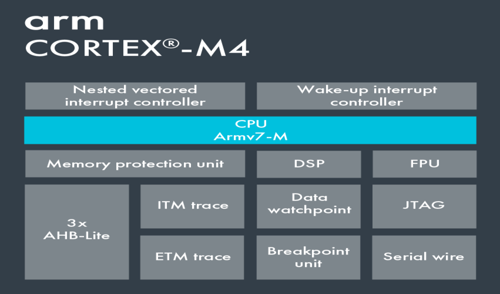

# Arm Cortex-M4 Template
A cross development [CMake](https://cmake.org/) project template for arm cortex-m4 based microcontrollers on `Linux` host.  
The main purpose of this template is to help embedded developers leverage CMake build features. Also,   
with this template, you are free to use your own favorite C/C++ code editor like `VS Code`, `Atom` etc.  



## Project Setup
An example setup has been provided for Texas Instruments [MSP-EXP432P401R](https://www.ti.com/store/ti/en/p/product/?p=MSP-EXP432P401R) board. The top-level project directory structure is as follows: 

+ app
    - Contains user level code and board/kernel configuration files.

+ bsp
    - This directory holds the support software provided by vendors in form of [SDK](https://www.ti.com/tool/download/SIMPLELINK-MSP432-SDK/3.20.00.06).
    - Following are common `SDK` submodules contained in this directory:
        + `board_essentials`
            - This directory contains the [system configuration](https://www.keil.com/pack/doc/CMSIS/Core/html/system_c_pg.html) and [startup](https://www.keil.com/pack/doc/CMSIS/Core/html/startup_c_pg.html) files.  
            It also includes the [CMSIS](https://www.keil.com/pack/doc/CMSIS/Core/html/index.html) header files. 
            - For example, below are the links to support files for popular boards:
                +  [TI MSP432P401R](http://software-dl.ti.com/msp430/msp430_public_sw/mcu/msp430/MSP432GCC/latest/index_FDS.html)
                +  [STLink STM32F4xx Discovery](https://github.com/charleskorn/stm32f4-project-template/tree/master/lib/stm32f4xx)
                +   [Nordic nRF52840](https://www.nordicsemi.com/Software-and-tools/Development-Tools/nRF-MDK/Download#infotabs)
        
        +  [driverlib](https://www.ti.com/tool/MSPDRIVERLIB): 
            - Software APIs that abstract away the details of the device’s hardware registers.

        +  `drivers`: 
            - Peripheral drivers for ADC, Timers, UART etc. These are portable drivers that  
            can be used across several similar boards from the same vendor.

+ kernel
    - Directory containing the kernel source and binary files such as those of [FreeRTOS](https://www.freertos.org/), [QNX](https://blackberry.qnx.com/en), [NuttX](https://nuttx.apache.org/) etc;


+ cross_compiler
    - This directory contains the [GNU Arm Embedded Toolchain](https://developer.arm.com/tools-and-software/open-source-software/developer-tools/gnu-toolchain/gnu-rm) to cross-compile your source code  
    and generate binaries for your cortex-m4 microcontroller.

+ CMakeLists.txt
    - Project top level cmake config file.

+ *.ld(s)
    - The linker script for the particular board provided by the vendor.

## Building and Compilation
The final output is generated inside the `bin` subdirectory of build directory. To generate the binary output,  
run following commands while in project directory, for example, in ti_msp432.  
For `debug` build:
```
$ mkdir debug
$ cd debug
$ cmake -DCMAKE_BUILD_TYPE=Debug ..
$ make
```
For `release` build:
```
$ mkdir release
$ cd release
$ cmake -DCMAKE_BUILD_TYPE=Release ..
$ make
```

## Target Flashing
The following tools can be used to flash the binary output into the target microcontroller:  
+ [TI's UniFlash](https://www.ti.com/tool/UNIFLASH)
+ [STM32 ST-LINK utility](https://www.st.com/en/development-tools/stsw-link004.html)
+ [Nordic's nrfjprog](https://www.nordicsemi.com/Software-and-tools/Development-Tools/nRF-Command-Line-Tools#infotabs)


